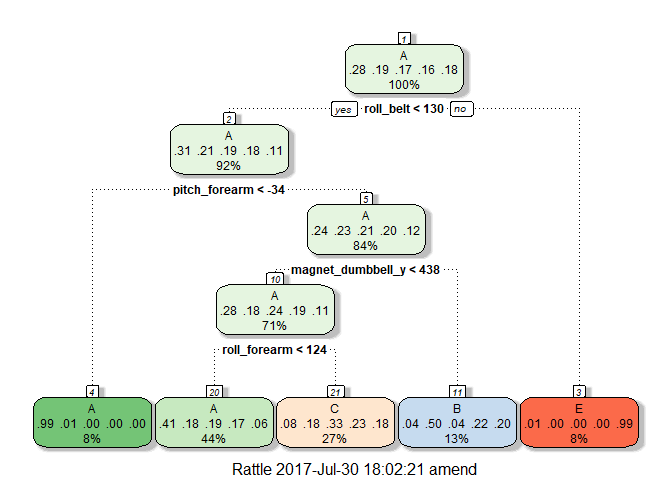

# Practical Machine Learning Project
Andrew Mendonca  
July 30, 2017  

## Introduction
Using devices such as Jawbone Up, Nike FuelBand, and Fitbit it is now possible to 
collect a large amount of data about personal activity relatively inexpensively. 
These type of devices are part of the quantified self movement - a group of enthusiasts 
who take measurements about themselves regularly to improve their health, to find 
patterns in their behavior, or because they are tech geeks. One thing that people 
regularly do is quantify how much of a particular activity they do, but they rarely 
quantify how well they do it. 

In this project, your goal will be to use data from accelerometers on the belt, 
forearm, arm, and dumbell of 6 participants. They were asked to perform barbell lifts 
correctly and incorrectly in 5 different ways. More information is available from the 
website here: http://groupware.les.inf.puc-rio.br/har.

## Load the data files

Load both the training and test files.


```r
train_file <- read.csv("pml-training.csv", na.strings = cbind("NA", ""))
test_file <- read.csv("pml-testing.csv", na.strings = cbind("NA", ""))
```
Determine how many observations and variables are in both of the files.


```r
dim(train_file)
```

```
## [1] 19622   160
```

```r
dim(test_file)
```

```
## [1]  20 160
```
The training data set has 19622 observations and 160 variables, whereas the
testing data set has 20 observations and 160 variables.

## Clean the data
Delete predictors of the training data set that have any missing values.


```r
train_file <- train_file[, colSums(is.na(train_file)) == 0]
test_file <- test_file[, colSums(is.na(train_file)) == 0]
```
Remove the first seven predictors that have less predicting power for the variable `classe`.


```r
train_value <- train_file[, -c(1:7)]
test_value <- test_file[, -c(1:7)]
dim(train_value)
```

```
## [1] 19622    53
```

```r
dim(test_value)
```

```
## [1]  20 153
```
The cleaned data sets `train_value` and `test_value` have the same number of observations
as the original training and testing data sets, but the data set `train_value` has 53
variables and the data set `test_value` has 153 variables.

## Splitting the data
To retrieve the out-of-sample errors, we split the data set `train_value` into a training
data set for prediction and a validation set for computing out-of-sample errors.


```r
library(caret)
```

```
## Loading required package: lattice
```

```
## Loading required package: ggplot2
```

```r
set.seed(7826)
values_in_train <- createDataPartition(train_value$classe, p = 0.7, list = FALSE)
train_split <- train_value[values_in_train, ]
valid_split <- train_value[-values_in_train, ]
```

## Classification Trees
When doing k-fold cross validation, we use the 5-fold cross validation to save time
for computing.


```r
library(rattle)
```

```
## Rattle: A free graphical interface for data mining with R.
## Version 4.1.0 Copyright (c) 2006-2015 Togaware Pty Ltd.
## Type 'rattle()' to shake, rattle, and roll your data.
```

```r
library(rpart)
library(rpart.plot)
library(e1071)
ctrl_values <- trainControl(method = "cv", number = 5)
fit_values <- train(classe ~ ., data = train_split, method = "rpart", trControl = ctrl_values)
print(fit_values, digits = 4)
```

```
## CART 
## 
## 13737 samples
##    52 predictor
##     5 classes: 'A', 'B', 'C', 'D', 'E' 
## 
## No pre-processing
## Resampling: Cross-Validated (5 fold) 
## Summary of sample sizes: 10989, 10989, 10990, 10989, 10991 
## Resampling results across tuning parameters:
## 
##   cp       Accuracy  Kappa  
##   0.03723  0.5241    0.38748
##   0.05954  0.4144    0.20668
##   0.11423  0.3482    0.09762
## 
## Accuracy was used to select the optimal model using  the largest value.
## The final value used for the model was cp = 0.03723.
```

```r
fancyRpartPlot(fit_values$finalModel)
```

<!-- -->

Use the validation data set to predict the outcome and then show the result.


```r
prediction_values <- predict(fit_values, valid_split)
confusion_values <- confusionMatrix(valid_split$classe, prediction_values)
print(confusion_values)
```

```
## Confusion Matrix and Statistics
## 
##           Reference
## Prediction    A    B    C    D    E
##          A 1544   21  107    0    2
##          B  492  391  256    0    0
##          C  474   38  514    0    0
##          D  436  175  353    0    0
##          E  155  138  293    0  496
## 
## Overall Statistics
##                                           
##                Accuracy : 0.5004          
##                  95% CI : (0.4876, 0.5133)
##     No Information Rate : 0.5269          
##     P-Value [Acc > NIR] : 1               
##                                           
##                   Kappa : 0.3464          
##  Mcnemar's Test P-Value : NA              
## 
## Statistics by Class:
## 
##                      Class: A Class: B Class: C Class: D Class: E
## Sensitivity            0.4979  0.51245  0.33749       NA  0.99598
## Specificity            0.9533  0.85396  0.88262   0.8362  0.89122
## Pos Pred Value         0.9223  0.34328  0.50097       NA  0.45841
## Neg Pred Value         0.6303  0.92162  0.79234       NA  0.99958
## Prevalence             0.5269  0.12965  0.25879   0.0000  0.08462
## Detection Rate         0.2624  0.06644  0.08734   0.0000  0.08428
## Detection Prevalence   0.2845  0.19354  0.17434   0.1638  0.18386
## Balanced Accuracy      0.7256  0.68321  0.61006       NA  0.94360
```

```r
accurate_value <- confusion_values$overall[1]
print(accurate_value)
```

```
##  Accuracy 
## 0.5004248
```
The accuracy rate appears to be 0.5, which means the out-of-sample error rate is 0.5. The
classification tree may not be useful for predicting the outcome `classe`.

## Random forests
We will use a random forest to predict the outcome instead of the classification tree.


```r
library(randomForest)
```

```
## randomForest 4.6-12
```

```
## Type rfNews() to see new features/changes/bug fixes.
```

```
## 
## Attaching package: 'randomForest'
```

```
## The following object is masked from 'package:ggplot2':
## 
##     margin
```

```r
fit_newvalue <- randomForest(classe ~ ., data = train_split)
print(fit_newvalue, digits = 4)
```

```
## 
## Call:
##  randomForest(formula = classe ~ ., data = train_split) 
##                Type of random forest: classification
##                      Number of trees: 500
## No. of variables tried at each split: 7
## 
##         OOB estimate of  error rate: 0.51%
## Confusion matrix:
##      A    B    C    D    E  class.error
## A 3903    2    1    0    0 0.0007680492
## B   12 2639    7    0    0 0.0071482318
## C    0   15 2380    1    0 0.0066777963
## D    0    0   23 2227    2 0.0111012433
## E    0    0    2    5 2518 0.0027722772
```

Use the validation data set to predict the outcome and then show the result.


```r
prediction_newvalues <- predict(fit_newvalue, valid_split)
confusion_newvalues <- confusionMatrix(valid_split$classe, prediction_newvalues)
print(confusion_newvalues)
```

```
## Confusion Matrix and Statistics
## 
##           Reference
## Prediction    A    B    C    D    E
##          A 1672    0    0    1    1
##          B    2 1135    2    0    0
##          C    0    2 1023    1    0
##          D    0    0   11  951    2
##          E    0    0    0    3 1079
## 
## Overall Statistics
##                                           
##                Accuracy : 0.9958          
##                  95% CI : (0.9937, 0.9972)
##     No Information Rate : 0.2845          
##     P-Value [Acc > NIR] : < 2.2e-16       
##                                           
##                   Kappa : 0.9946          
##  Mcnemar's Test P-Value : NA              
## 
## Statistics by Class:
## 
##                      Class: A Class: B Class: C Class: D Class: E
## Sensitivity            0.9988   0.9982   0.9875   0.9948   0.9972
## Specificity            0.9995   0.9992   0.9994   0.9974   0.9994
## Pos Pred Value         0.9988   0.9965   0.9971   0.9865   0.9972
## Neg Pred Value         0.9995   0.9996   0.9973   0.9990   0.9994
## Prevalence             0.2845   0.1932   0.1760   0.1624   0.1839
## Detection Rate         0.2841   0.1929   0.1738   0.1616   0.1833
## Detection Prevalence   0.2845   0.1935   0.1743   0.1638   0.1839
## Balanced Accuracy      0.9992   0.9987   0.9934   0.9961   0.9983
```

```r
accurate_newvalue <- confusion_newvalues$overall[1]
print(accurate_newvalue)
```

```
##  Accuracy 
## 0.9957519
```
The accuracy rate is 0.996, which means the out-of-sample error rate is 0.009. This is
probably because many of the predictors are highly correlated. Using random forests can
lead to more accurate results, even though they may be difficult to interpret.

## Prediction
Now for the testing data set, let's use the random forest to predict the outcome `classe`.


```r
(predict(fit_newvalue, test_value))
```

```
##  1  2  3  4  5  6  7  8  9 10 11 12 13 14 15 16 17 18 19 20 
##  B  A  B  A  A  E  D  B  A  A  B  C  B  A  E  E  A  B  B  B 
## Levels: A B C D E
```
